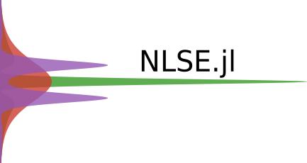

# Nlse.jl

 A non-linear Schrödinger equation solver for julia aimed towards fiber optics.

## Roadmap

- [x] Implement Split-Step Method
- [ ] Higher order integral solver (**DifferentialEquations.jl**)
- [ ] Add more non-linear processes (Raman & Brillouin scattering)

## Instalation

* TODO
