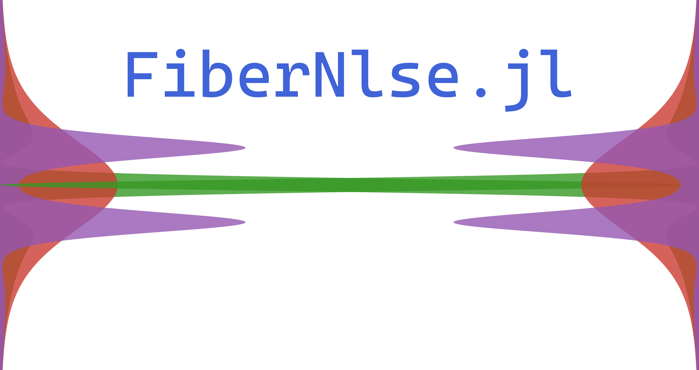

# 
 A non-linear Schrödinger equation solver for julia aimed towards fiber optics.

## Roadmap

- [x] Implement Split-Step Method
- [x] Add progress bar option
- [ ] Document code
- [ ] Setup continuous integration
- [ ] Add non constant dispersion (and higher order dispersion)
- [ ] Create a documentation page (mdbook ?)
- [ ] Higher order integral solver (**DifferentialEquations.jl**)
- [ ] Add more non-linear processes (Raman & Brillouin scattering)

## Installation
To install you can simply type `] add FiberNlse` in your julia terminal or clone this repository and include the `src/FiberNlse.jl` file in your project.

### source : https://www.fiberoptics4sale.com/blogs/wave-optics/solitons-in-optical-fibers