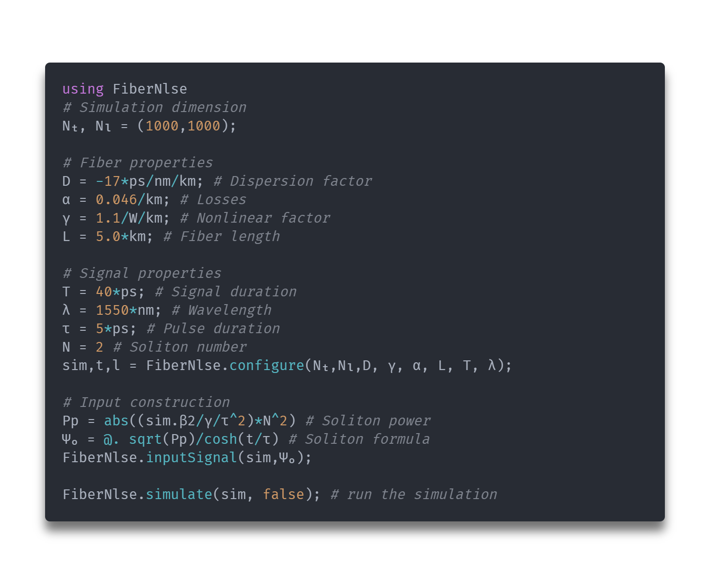

<p align="center">

</p>

# [](https://doi.org/10.5281/zenodo.6331654) [](https://github.com/curio-sitas/FiberNlse.jl/actions/workflows/build_pkg_tests.yml)
 A non-linear Schrödinger equation solver for julia aimed towards fiber optics. (🚧 Under development)

## Features

The *FiberNlse.jl* package simulates the propagation of an optical field envelope signal of duration **T** in an optical fiber of length *L*. The chromatic dispersion (**D**) and SPM (self-phase modulation) (**γ**) wich arises from **Kerr** non-linearity are taken as parameters.

The core of the simulation consists in the integration of the *Non-Linear Schrödinger Equation* with the desired signal as initial condition.

---

## Examples
### Sech² Soliton
One can simulate the propagation of sech² soliton (order N=2) in an SMF-28 optical fiber by typing the following script :


Wich gives the following result :


### Self-phase modulation
### Time-lens compression
### Other types of solitons
### Soliton collision ? (Maybe)

## Installation
To install you can simply type :
```
] add FiberNlse
```
in your julia terminal or clone this repository and include the `src/FiberNlse.jl` file in your project.

## Roadmap

- [x] Implement Split-Step Method
- [x] Add progress bar option
- [x] Register DOI
- [ ] Document code
- [x] Setup continuous integration
- [ ] Add non constant dispersion (and higher order dispersion)
- [ ] Create a documentation page (mdbook ?)
- [ ] Higher order integral solver (**DifferentialEquations.jl**)
- [ ] Add more non-linear processes (Raman & Brillouin scattering)

## Citation

Please cite this repository if you use it to publish data in a research paper.


```
@software{sinquin_brian_2022_6331654,
  author       = {Sinquin Brian},
  title        = {FiberNlse.jl},
  month        = mar,
  year         = 2022,
  publisher    = {Zenodo},
  version      = {1.0.0},
  doi          = {10.5281/zenodo.6331654},
  url          = {https://doi.org/10.5281/zenodo.6331654}
}
```

### source : https://www.fiberoptics4sale.com/blogs/wave-optics/solitons-in-optical-fibers