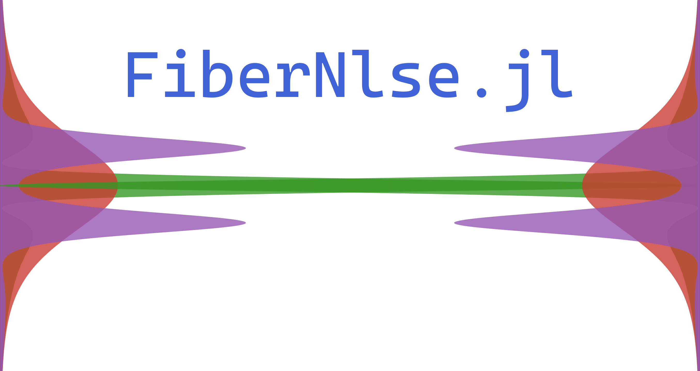

<p align="center">

</p>

---

[](https://doi.org/10.5281/zenodo.8251777) [](https://github.com/brian-sinquin/FiberNlse.jl/actions/workflows/CI.yml) [](https://juliaci.github.io/NanosoldierReports/pkgeval_badges/report.html) [](https://codecov.io/gh/curio-sitas/FiberNlse.jl) [](https://github.com/invenia/BlueStyle) [](https://github.com/SciML/ColPrac)

Documentation : [](https://curio-sitas.github.io/FiberNlse.jl/stable) [](https://curio-sitas.github.io/FiberNlse.jl/dev)

---

 A Generalised Non-Linear Schrödinger Equation (GNLSE) solver for julia aimed towards fiber optics or other waveguides. 

## Features

The *FiberNlse.jl* package simulates the propagation of an optical field envelope signal in a waveguide showing *Kerr* nonlinearity, group velocity dispersion, Raman scattering and linear losses.

The algorithm used is ERK4(5)-IP with adaptative step-size. The **API** permits to include the Raman scattering or/and self-steepening in the integration process.

---

## Installation
To install you can simply type :
```
] add FiberNlse
```
in your julia terminal or clone this repository and include the `src/FiberNlse.jl` file in your project.

## ⚙️ Current development state

- [x] Implement ERK4(5)-IP integration
- [x] Register DOI
- [ ] Document code
- [ ] New Logo / Visuals
- [ ] Benchmark / Comparison with other language packages (Python/Matlab/C)
- [ ] Documentation + sources
- [ ] Examples (NL Compression, MI, Super-Continuum, Flaticons, Similaritons, Solitons, Dispersion spreading)
- [x] Setup continuous integration
- [ ] Add progress bar option
- [x] higher order dispersion
- [ ] Add variable dispersion, loss and nonlinearity
- [x] Add Self-steepening
- [x] Add Raman scattering
- [ ] Utils and helper functions for visualization and field manipulation
- [ ] Phase sign convention

     
## 💡 Future ideas
- [ ] Many solvers (as in [pychi](https://github.com/pychi-code/pychi/tree/main))    

## 🤝 Contributions

Any help to optimize, refactor or enrich the package is welcome, whatever it is on the core side or practical examples.
Don't hesitate to open an issue if something goes wrong with the package.

## 📝 Citation

Please cite this repository if you use it to publish data in a research paper.


```
@software{sinquin_fibernlse,
  author       = {Sinquin Brian},
  title        = {FiberNlse.jl},
  month        = mar,
  year         = 2022,
  publisher    = {Zenodo},
  doi          = {10.5281/zenodo.8251777},
  url          = {https://doi.org/10.5281/zenodo.8251777}
}
```
